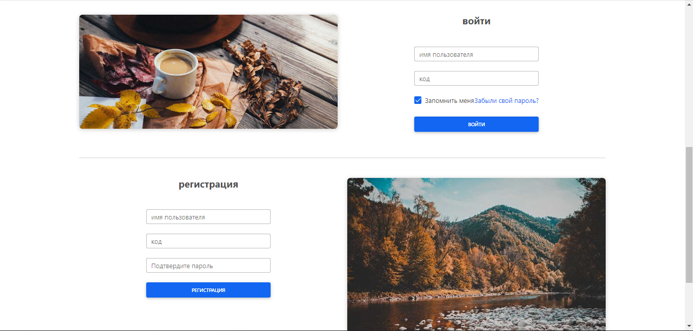
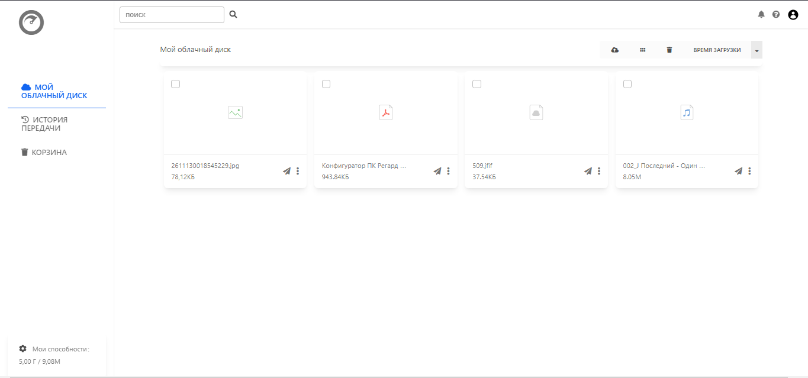
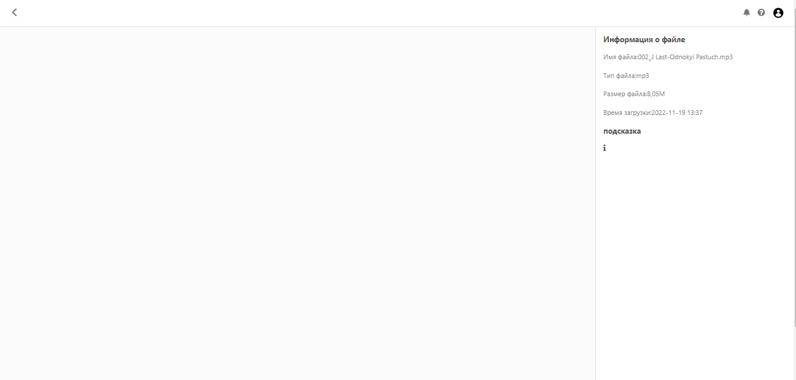
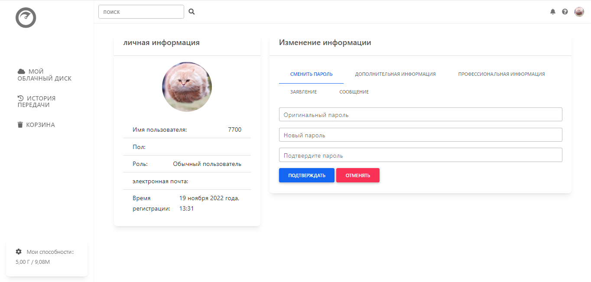

# mycloud
Мой дипломный проект  


### Запуск локально
___
1. Установка зависимостей
```
pip install -r requirements.txt
```
2. Проверьте файл конфигурации, измените конфигурацию почтового ящика и базы данных
```
# mycloud/settings.py

EMAIL_HOST = 'smtp.qq.com'
EMAIL_PORT = '587'
EMAIL_HOST_USER = '******'
EMAIL_HOST_PASSWORD = '******'
EMAIL_USE_TLS = True
DEFAULT_FROM_EMAIL = EMAIL_HOST_USER


DATABASES = {
    'default': {
        'ENGINE': 'django.db.backends.mysql',
        'NAME': 'cloud',
        'HOST': '127.0.0.1',
        'PORT': '3306',
        'USER': '***',
        'PASSWORD': '******',
    }
}
```
3. Перенос базы данных
```
python manage.py migrate
```
4. Запустите базовый sql-файл
```
mysql> use cloud;
mysql> source C:/Users/..../.sql; 
```
5. Создайте суперпользователя
```
python manage.py createsuperuser
```
6. Запустите локальный сервер
```
python manage.py runserver
```
### Скриншот страницы
___ 
Вход или Регистрация  

  

Список файлов  

  

Сведения о файле  

  

Личная информация 

  

